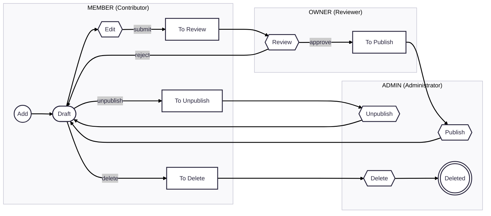

# RFC: Document Publication Workflow with Admin Approval
**Status**: Draft  
**Author(s)**: Guilbert Pierre
**Created**: 2025-09-09

## Summary

**Problem**: Public project contributions are immediately visible, causing:
- Quality control issues
- Brand reputation risks
- Compliance concerns
- Degraded user experience

**Solution**: Implement a state-based project publication workflow with role-based permissions requiring administrative approval before contributions go live.

**Key Features**:
- Six project states: Draft, In Review, To Publish, To Unpublish, To Delete, Locked
- Three user roles leveraging existing system roles: MEMBER (Contributor), OWNER (Reviewer), ADMIN (Administrator)
- Controlled publication process ensuring content quality

## Current System Context

The GBDI platform currently implements a role-based permission system with three distinct roles:

| Role     | Description                            | Key Permissions                                                                 |
| -------- | -------------------------------------- | ------------------------------------------------------------------------------- |
| **ADMIN**| System administrator with full access  | All permissions across the platform                                             |
| **OWNER**| Organization/project owner             | Manage contributions, members, and organizations within their scope             |
| **MEMBER**| Standard user                         | Create and manage their own contributions; view members and organizations      |

This RFC builds upon the existing role system to implement a controlled publication workflow.

## Basic Example

A MEMBER (Contributor) creates a new project contribution:
1. They work on it in the "Draft" state, iterating as needed
2. When ready, they submit it for review, changing its state to "In Review"
3. An OWNER (Reviewer) examines the contribution and either approves it ("To Publish") or rejects it (back to "Draft")
4. An ADMIN (Administrator) publishes the approved contribution, making it visible to all users
5. If issues arise later, ADMIN users can unpublish or delete the contribution as needed

## Motivation

Publishing content immediately causes issues:

• **Bad Quality**: No one checks content before it goes live
• **Hurts Reputation**: Poor content damages trust
• **Policy Problems**: Might break content rules
• **Worse Experience**: Inconsistent quality makes platform worse

Contributors and users get frustrated. We need to review content before publishing to keep quality high without slowing things down too much.

## Detailed Design

### Project States

Each Project can have one of the following states:

| State            | Description                                                                                |
| ---------------- | ------------------------------------------------------------------------------------------ |
| **Draft**        | The project is being added or edited and is not yet ready for review.                      |
| **In Review**    | The project is ready for review by a reviewer.                                             |
| **To Publish**   | The project has been reviewed and approved for publication by a reviewer.                  |
| **To Unpublish** | The project is currently published and needs to be unpublished by an administrator.        |
| **To Delete**    | The project is marked for deletion by an administrator.                                    |
| **Locked**       | The project is locked by an administrator and cannot be edited, (un)published or deleted.  |

### User Roles and Permissions

The publication flow leverages the existing platform roles, each with specific permissions in the workflow context:

| Role              | Workflow Function     | Permissions                                                                  |
| ----------------- | --------------------- | ---------------------------------------------------------------------------- |
| **MEMBER**        | Contributor           | Can add and edit their own project contributions.                            |
| **OWNER**         | Reviewer              | Can add and edit all project contributions but cannot (un)publish, or delete them. |
| **ADMIN**         | Administrator         | Can perform all operations, including project (un)publication and deletion.  |

**Role-to-Workflow Mapping:**
- **MEMBER** users act as Contributors in the workflow, creating and managing their own project contributions
- **OWNER** users act as Reviewers, examining contributions from others and determining if they should be published
- **ADMIN** users act as Administrators, performing final publication actions and handling exceptional cases

### State Transitions

The following diagram illustrates the publication flow for projects and the different role responsibilities:

### Implementation Strategy

**Phase 1: Core State Machine**
- Implement the six-state project lifecycle with proper state transitions
- Build role-based permission system with clear access controls
- Create basic workflow UI for state management

**Phase 2: Review Interface**
- Develop reviewer dashboard for efficient content assessment
- Implement review feedback and rejection reason tracking
- Add batch operations for high-volume review scenarios

**Phase 3: Advanced Features**
- Administrator override capabilities for urgent situations
- Project locking mechanism for sensitive content
- Analytics and reporting for workflow performance

**Technical Approach**: Extend existing project model with state field, implement middleware for permission checking, and use event-driven architecture for state transitions.

### UI Requirements

#### Admin Tab
- **Pending Queue** section showing:
 - Contributor name
 - Project title  
 - Submission date
- **Actions**: Preview, Approve, Reject buttons
- **Bulk operations** for multiple items
- **Filters**: Date, category, contributor

#### User Experience
- **Status indicator**: "Pending Review" on submissions
- **Notifications**: 
  - Email notification to administrators when a draft is submitted for review
  - Email notification to reviewers when an administrator assigns a review to them
  - Email notification to contributors on approval/rejection
- **Feedback**: Display admin comments for rejections

#### Dashboard
- Pending contributions count
- Recently approved items
- Quick stats for admins

### Acceptance Criteria
- [ ] Admin can view all pending contributions
- [ ] Admin can preview before approving
- [ ] Users see submission status
- [ ] Email notifications work
- [ ] Bulk approve/reject functionality

## Drawbacks

- **Increased Complexity**: The approval workflow adds complexity for contributors who must now wait for review before their contributions are visible
- **Resource Requirements**: Requires dedicated reviewers and administrators to maintain reasonable turnaround times
- **Potential Bottlenecks**: Could create delays in content publication if reviewers are not responsive
- **Training Overhead**: Users need to understand the new workflow and their role-specific permissions

## Alternatives

**Auto-approval with post-publication moderation**: Rejected due to inability to prevent poor content from reaching users initially, creating negative first impressions.

**Single-step admin approval**: Rejected as it would create bottlenecks and doesn't leverage reviewer expertise for content assessment.

**Community voting system**: Rejected due to complexity, potential for gaming, and lack of accountability for quality standards.

**AI-only moderation**: Rejected as insufficient for nuanced content assessment and context understanding required for technical documentation.

## Adoption Strategy

1. **Phased Rollout**: Introduce the workflow first for new contributions while existing content remains unaffected
2. **User Education**: Provide documentation and training materials for all user roles
3. **Gradual Migration**: Over time, migrate existing content to the new workflow system
4. **Feedback Loop**: Collect user feedback during initial rollout to identify pain points and areas for improvement
5. **Monitoring**: Track key metrics like review times, approval rates, and user satisfaction to ensure successful adoption

## How We Teach This

1. **Documentation**: Create comprehensive documentation covering the workflow, roles, and state transitions
2. **UI Guidance**: Implement tooltips and contextual help within the application interface
3. **Training Sessions**: Conduct training sessions for reviewers and administrators
4. **FAQ and Troubleshooting Guide**: Provide resources for common questions and issues
5. **Video Tutorials**: Create video walkthroughs demonstrating the workflow for each user role

## Community Input Needed

- **Reviewer Capacity Planning**: How many reviewers are needed to maintain 24-hour turnaround times?
- **Escalation Procedures**: What process should handle reviewer disagreements or edge cases?
- **Emergency Override**: When should administrators bypass the review process for urgent updates?
- **Content Categories**: Should different project types have different review requirements or SLAs?

## Unresolved Questions

- Should we implement automated pre-screening to reduce reviewer workload?
- How should we handle bulk updates or migrations of existing content?
- What notification system will keep contributors/reviewers informed of review status without creating spam?
- How will we handle reviewer training and onboarding for consistent quality standards?
