# TLDR - Workflow Summary

**Roles**: Lead Developer (implementation), Code Reviewer (quality), Project Manager (coordination)

**Environments**: 
- Development (auto-deploy): https://app-gbdi-dev.epfl.ch/
- Staging (manual: dev onto stage): https://stage.app.gbdi.io
- Production (bi-weekly): https://app.gbdi.io

**Process**: Issue → Branch → PR → Code Review → Dev Merge → Staging → Production

**Branch Flow**: `main` (prod) ← `stage` ← `dev` ← feature/fix branches

**Reviews**: Code review in 1-2 days, staging validation bi-weekly

---

# Document Workflow - Review Process

## Context: Project Roles

### 🧑🏼‍💻 Lead Developer
- **Responsible** for implementation of the project and delivering deliverables within timeline (or *informing* project manager as early as possible of foreseen delays), and conducting regular code reviews
- **Accountable** for code quality, software engineering standards and best practices, reproducibility
- Decides on choice of technologies used, after IT4R team consultation

### 🧑🏼‍💻 Code Reviewer (Co-maintainer)
- **Consulted** for recommendations and support on ongoing project
- **Co-maintainer**: must be able to take over the project if the lead developer is unavailable
- Responsible for validating pull requests and ensuring code quality standards

### 🧑🏼‍🌾 Project Manager
- **Responsible** for defining realistic deliverables, following up with the project, doing dissemination, project valorisation and further connections with the lab
- **Accountable** for signing agreements, regular interactions with collaborators, ensuring they are *informed* about progress, and financial aspects
- Responsible for keeping Notion cards up-to-date and conducting retrospectives
- Validates features on development platform when time allows

## Deployment Environments

| Environment | URL | Purpose | Deployment Trigger |
|-------------|-----|---------|-------------------|
| **Development** | https://app-gbdi-dev.epfl.ch/ | Feature testing and validation | Automatic on merge to `dev` branch |
| **Staging** | https://stage.app.gbdi.io | Pre-production testing | Manual deployment from `dev` to `stage` |
| **Production** | https://app.gbdi.io | Live application | Bi-weekly release from `stage` to `main` |

## Kanban Board Statuses

| Status | Color | Description | Trigger |
|--------|-------|-------------|---------|
| **Todo** | 🟢 Green | This item hasn't been started | Issue created and assigned |
| **In Progress** | 🟡 Yellow | This is actively being worked on | Development started |
| **In Review** | 🔵 Blue | Code review in progress | Pull request created |
| **Done** | 🟣 Purple | This has been completed | Feature deployed to production |
| **On Hold** | 🔴 Red | Temporarily paused | Blocked or deprioritized |

## Issue Lifecycle Workflow

### Phase 1: Development & Initial Review

1. **Issue Creation**
   - Issue created on GitHub with appropriate labels and description
   - Issue assigned to Lead Developer
   - **📋 Kanban Status**: Move to **Todo** 🟢

2. **Branch Creation & Development Start**
   - **Actor**: Lead Developer
   - **Action**: Create git branch with naming convention: `{type}/{issue-number}-{brief-description}`
   - **Examples**: 
     - `feature/123-user-authentication`
     - `fix/456-api-timeout-bug`
   - **📋 Kanban Status**: Move to **In Progress** 🟡

3. **Pull Request Creation**
   - **Actor**: Lead Developer
   - **Action**: Create pull request from feature/fix branch → `dev` branch
   - **Requirements**: 
     - Descriptive title and description
     - Link to original GitHub issue
     - Self-review completed
   - **📋 Kanban Status**: Move to **In Review** 🔵

4. **Code Review**
   - **Actor**: Code Reviewer
   - **Action**: Review and validate the pull request
   - **Criteria**: 
     - Code quality and standards compliance
     - Functionality correctness
     - Test coverage adequacy
     - Documentation updates
   - **📋 Kanban Status**: Keep in **In Review** 🔵 (until approved)

### Phase 2: Development Environment Testing

5. **Merge to Development**
   - **Actor**: Lead Developer (after approval)
   - **Action**: Merge pull request to `dev` branch
   - **Automatic Trigger**: Continuous deployment to development environment
   - **Result**: Feature available at https://app-gbdi-dev.epfl.ch/

6. **Development Validation**
   - **Actors**: Project Manager or Code Reviewer
   - **Action**: Validate feature functionality on development platform
   - **Frequency**: At least once if time allows
   - **Focus**: User experience and feature completeness

### Phase 3: Staging & Pre-production

7. **Staging Deployment**
   - **Actor**: Lead Developer
   - **Action**: Merge `dev` → `stage` branch and deploy to staging
   - **Timing**: 1-2 days prior to GBDI team review
   - **Result**: Feature available at https://stage.app.gbdi.io

8. **Staging Validation**
   - **Timing**: Every two weeks
   - **Actors**: GBDI full team
   - **Action**: Comprehensive review of all staged features
   - **Focus**: Final validation before production release

### Phase 4: Production Release

9. **Production Deployment**
   - **Actor**: Lead Developer (after GBDI team approval)
   - **Action**: Merge `stage` → `main` branch
   - **Automatic Trigger**: Continuous deployment creates release and deploys to production
   - **Result**: Feature live at https://app.gbdi.io
   - **📋 Kanban Status**: Move to **Done** 🟣

10. **Post-Release Cleanup**
    - **Action**: Rebase `stage` and `dev` branches onto latest `main` release
    - **Purpose**: Maintain clean git history and sync environments

## Special Kanban Status Scenarios

### On Hold Status 🔴
Move issues to **On Hold** when:
- **Blocked by external dependencies**: Waiting for API access, third-party services
- **Deprioritized**: PM decides to pause work on this feature
- **Technical blockers**: Architectural decisions needed before proceeding
- **Resource constraints**: Developer temporarily unavailable

**Return from On Hold**: Move back to appropriate status (Todo/In Progress) when blocker is resolved

### Status Change Responsibilities

| Status Change | Responsible Actor | When |
|---------------|------------------|------|
| Todo → In Progress | Lead Developer | When starting development work |
| In Progress → In Review | Lead Developer | When creating pull request |
| In Review → In Progress | Lead Developer | If changes requested during code review |
| In Review → Done | Lead Developer | After successful production deployment |
| Any Status → On Hold | Project Manager or Lead Developer | When blocked or deprioritized |
| On Hold → Previous Status | Project Manager or Lead Developer | When blocker resolved |

## Branch Strategy & Rules

### Branch Hierarchy
```
main (production) ← stage ← dev ← feature/fix branches
```

### Merging Rules

#### ✅ **Allowed Merges**
- **Feature/Fix branches** → `dev`: All new features and fixes
- **`dev`** → `stage`: 1-2 days before team review
- **`stage`** → `main`: After GBDI team approval (bi-weekly)

#### ⚠️ **Conditional Merges**
- **Hotfixes**: Can be applied to both `dev` and `stage` simultaneously for urgent production issues

#### ❌ **Prohibited Merges**
- **New features** directly to `stage`: Must go through `dev` first to avoid confusion
- **Direct merges** to `main`: Must go through staging validation

### Branch Maintenance
- **Post-release**: Both `stage` and `dev` branches are rebased onto the latest `main` release
- **Cleanup**: Feature branches deleted after successful merge to `dev`

## Quality Gates

### Code Review Checklist
- [ ] Code follows established style guidelines
- [ ] All tests pass (unit, integration, e2e)
- [ ] Documentation updated where necessary
- [ ] No security vulnerabilities introduced
- [ ] Performance impact assessed
- [ ] Backward compatibility maintained

### Environment Validation Checklist
- [ ] **Development**: Feature works as expected
- [ ] **Staging**: Full team approval received
- [ ] **Production**: Successful deployment verified

## Communication Protocol

### Notifications
- **Pull Request Created**: Notify Code Reviewer
- **Development Deployed**: Notify Project Manager for validation
- **Staging Ready**: Notify GBDI team for review
- **Production Released**: Notify all stakeholders

### Escalation
- **Delays**: Lead Developer informs Project Manager immediately
- **Blocking Issues**: Code Reviewer escalates to Lead Developer
- **Production Issues**: Immediate notification to all team members

## Timeline Expectations

| Phase | Duration | Flexibility |
|-------|----------|-------------|
| Code Review | 1-2 days | Standard |
| Dev Validation | As time allows | Optional |
| Staging Review | Bi-weekly cycle | Fixed |
| Production Release | Same day as approval | Fixed |

---

## Process Flow Diagram

```mermaid
graph TD
    A[GitHub Issue Created<br/>📋 Todo 🟢] --> B[Lead Dev: Create Branch<br/>📋 In Progress 🟡]
    B --> C[Lead Dev: Create PR to dev<br/>📋 In Review 🔵]
    C --> D[Code Reviewer: Review PR<br/>📋 In Review 🔵]
    D --> E{PR Approved?}
    E -->|No| F[Lead Dev: Address Feedback<br/>📋 In Progress 🟡]
    F --> C
    E -->|Yes| G[Lead Dev: Merge to dev<br/>📋 In Review 🔵]
    G --> H[Auto Deploy to Development<br/>📋 In Review 🔵]
    H --> I[PM/Reviewer: Validate on Dev<br/>📋 In Review 🔵]
    I --> J[Lead Dev: Merge dev to stage<br/>📋 In Review 🔵]
    J --> K[Deploy to Staging<br/>📋 In Review 🔵]
    K --> L[GBDI Team: Review Staging<br/>📋 In Review 🔵]
    L --> M{Staging Approved?}
    M -->|No| N[Address Issues in dev/stage<br/>📋 In Progress 🟡]
    N --> J
    M -->|Yes| O[Lead Dev: Merge stage to main<br/>📋 Done 🟣]
    O --> P[Auto Deploy to Production<br/>📋 Done 🟣]
    P --> Q[Rebase stage and dev onto main<br/>📋 Done 🟣]
    
    %% On Hold scenarios
    A -.->|Blocked/Deprioritized| R[📋 On Hold 🔴]
    B -.->|Blocked/Deprioritized| R
    C -.->|Blocked/Deprioritized| R
    R -.->|Blocker Resolved| S[Return to appropriate status]
    
    style A fill:#e1f5fe
    style H fill:#f3e5f5
    style K fill:#fff3e0
    style P fill:#e8f5e8
    style Q fill:#fafafa
    style R fill:#ffebee
```



## Emergency Procedures

### Hotfix Process
1. Create hotfix branch from `main`
2. Implement fix with expedited review
3. Deploy to `dev` and `stage` simultaneously
4. Emergency production deployment after minimal validation
5. Post-deployment: ensure fix is properly integrated into normal workflow

### Rollback Procedure
1. Identify rollback target (previous stable release)
2. Deploy previous version to production
3. Investigate and fix issues in development environment
4. Follow normal workflow for re-deployment

---

*Last updated: [2025.08.26]*
*Document version: 4.0*
